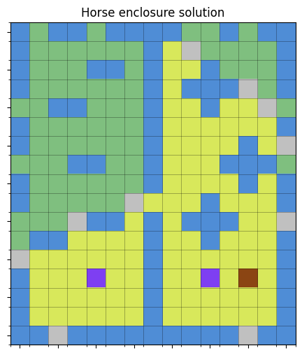

# Enclose Horse Solver

An integer programming solver for the [horse-enclosure puzzle](https://enclose.horse). It parses text map inputs, models the enclosure as a MILP, and can solve and visualize solutions.

## Installation

```bash
python -m venv .venv
source .venv/bin/activate
pip install -r requirements.txt
pip install -e .
```

## Usage

```bash
python -m enclose_horse.cli --map example_map.txt --max-walls 13 --plot solution.png [--show] [--solver cp-sat|cp-sat-2]
```

### CLI options

- `--map PATH` (required): text map file.
- `--max-walls N`: wall budget (default: 13).
- `--plot PATH`: save a rendered PNG of the solution.
- `--show`: display the matplotlib window instead of/as well as saving.
- `--solver {ilp,cp-sat,cp-sat-2}`: choose MILP (default), CP-SAT with flow (cp-sat), or CP-SAT with Boolean reachability (cp-sat-2).

## Example Solution

Portal map ([2026-01-10](https://enclose.horse/play/2026-01-10)) solved with 10 walls (score 94):



The horse is the brown square, portals are purple, walls are green, water is blue, and scoring tiles are yellow.

## Map format

- `~` water (impassable)
- `.` grass (empty ground)
- `H` horse (must be enclosed)
- `0-9` portals; identical digits are linked
- `C` cherries; yield +3 when enclosed (tile is worth 4 total)

See `example_map.txt`, `portal_map.txt`, and `cherry_map.txt` for reference layouts. Note that this follows the ascii map layout in the comment of the enclose.horse website.

## Solver flow

1) **Parse**: load the grid, identify the horse, portals, cherries, and candidate tiles (anything that is not water).
2) **Adjacency**: build 4-neighbor edges among candidates and connect identical portal IDs.
3) **Variables**: for each candidate tile:
   - `wall` (binary): wall placement (forbidden on portals/cherries/horse).
   - `inside` (binary): whether the tile is inside the enclosure (horse fixed to 1; boundary tiles forced to 0).
4) **Constraints**:
   - Mutually exclusive `wall + inside <= 1`.
   - Boundary tiles cannot be inside.
   - Portals/cherries cannot be walls; horse inside=1, wall=0.
   - **Separation**: if two adjacent tiles differ in inside status, at least one is a wall.
   - **Connectivity**: single-commodity flow rooted at the horse; flow capacity tied to `inside` and `1 - wall`; root supplies `sum(inside)` for other inside tiles.
   - Wall budget: total walls ≤ `max-walls`.
5) **Objective**: maximize `sum(inside)` plus `3 * inside` for cherries (horse counts via inside=1).

## Testing

```bash
pytest
```

Key expectations: example map optimal = 103 with 13 walls; portal map optimal = 94 with 10 walls; cherry map optimal = 66 with 12 walls.

## TODO

- Accept a screenshot as input, or an enclose.horse puzzle url.

- Rewrite the cp-sat solver to use binary variables rather than the bigm approach
